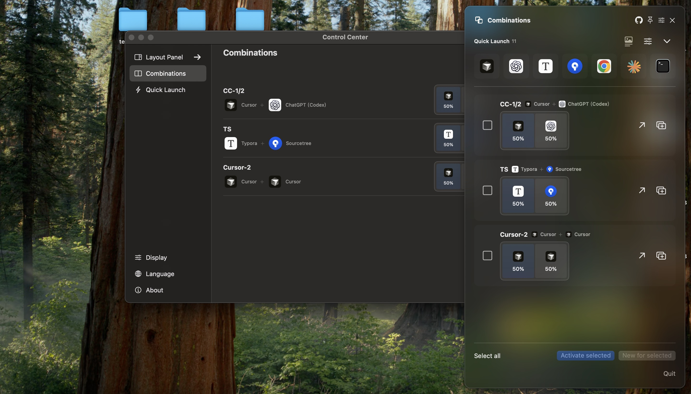
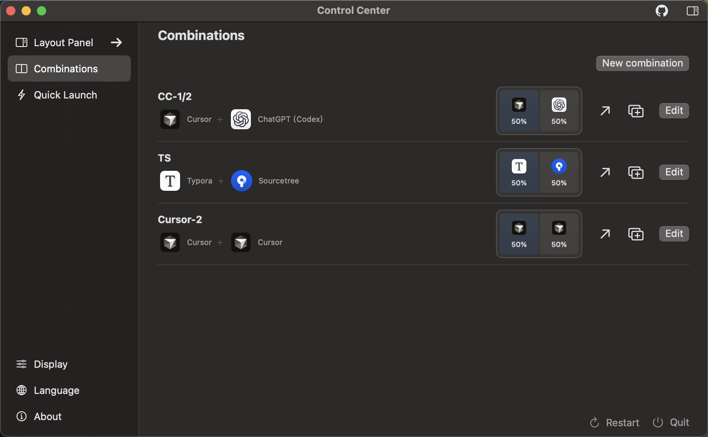
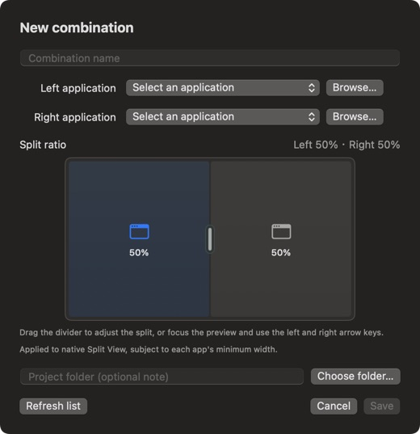
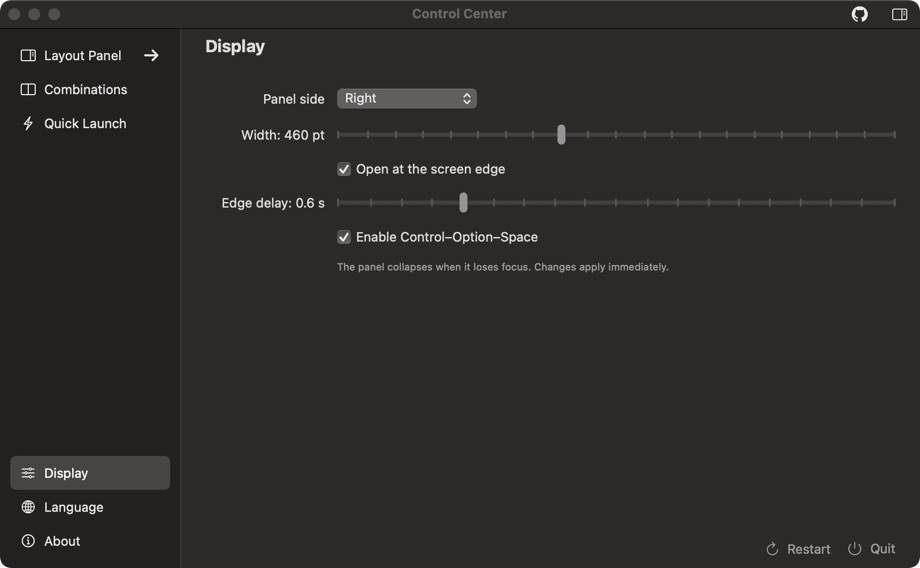

<p align="center">
  
</p>

<h1 align="center">Twist Spaces</h1>

<p align="center">一款用于成对启动应用并排列窗口的原生 macOS 工作区管理工具。</p>

<p align="center">
  <a href="README.md">English</a> · <a href="README.zh-CN.md">简体中文</a> · <a href="LICENSE">MIT License</a>
</p>



Twist Spaces 由完整的控制中心和紧凑的桌面布局面板组成。你可以保存常用的应用组合、设置 Split View 比例，再从菜单栏或屏幕边缘快速打开组合。

## 核心功能

- 创建可复用的应用组合，选择左右两个应用、填写可选的项目文件夹备注，并设置 10:90 至 90:10 的分屏比例。
- 同时启动或激活组合中的应用，也可以让支持的运行中应用分别新建窗口。
- 捕获对应窗口，尝试通过 macOS 原生 Split View 完成配对，并将分隔条调整到保存的比例。
- 通过可配置的快速启动区域单独打开常用应用。
- 从菜单栏、屏幕边缘或 Control–Option–Space 打开布局面板。
- 设置面板所在侧、宽度、边缘触发延迟和全局快捷键。
- 通过带保护的原子写入在本机保存应用组合与设置。
- 使用英文、简体中文或跟随系统语言的界面。

## 界面

### 管理应用组合



### 新建与配置

| 新建应用组合 | 配置布局面板 |
| --- | --- |
|  |  |

## 环境要求

- macOS 15 或更高版本
- Xcode Command Line Tools 或 Xcode 提供的 Swift 6.1 或更高版本
- 新建窗口检测、窗口检查及原生 Split View 自动化需要辅助功能权限

项目无需包管理器或第三方依赖。

## 构建与运行

克隆仓库：

```bash
git clone https://github.com/CELFS/twist-spaces.git
cd twist-spaces
```

首次使用时创建本机开发签名身份：

```bash
bash claude_jobs/setup-local-signing.sh
```

构建并打开 Debug 应用：

```bash
bash claude_jobs/build-app.sh
open "build/debug/Twist Spaces.app"
```

生成的应用位于 `build/debug/Twist Spaces.app`。构建脚本不会将其安装到 `/Applications`，也不会执行公证。

构建 Release 版本：

```bash
bash claude_jobs/build-app.sh release
```

Release 应用位于 `build/release/Twist Spaces.app`。

## 使用方法

1. 打开控制中心，选择两个应用并创建组合。
2. 设置左右窗口比例，然后保存组合。
3. 打开布局面板，再选择激活应用或分别新建窗口。

可选的项目文件夹字段目前仅作为备注使用，不能重新打开指定项目窗口。原生 Split View 自动化依赖辅助功能权限，以及所选应用提供的兼容操作。

## 测试

在项目根目录运行 Swift 测试：

```bash
swift test --disable-xctest
```

## 本地数据

应用组合保存在：

```text
~/Library/Application Support/Twist Spaces/workspaces.json
```

Twist Spaces 不会通过网络发送工作区数据或诊断报告。

## 开源协议

Twist Spaces 基于 [MIT License](LICENSE) 开源。
